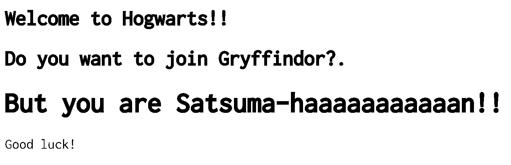

# webserv
This project is about writing HTTP server. You will be able to test it with an actual browser.

<br></br>

## How to build server

```bash
make
```

## How to run server
./webserv <port>

```bash
./webserv 8080
```

If you ccess http://localhost:8080/, you will get static page like the image below.


<br></br>
If you access http://localhost:8080/cgi/cgi?Gryffindor, you will get dynamic page.



<br></br>
If the wrong page is accessed(http://localhost:8080/Gryffindor), an error page will be displayed.


<br></br>
## How to build client

```bash
make client
```

## How to run client
./client [host] [port] [use_stdin] [repeat_times]

```bash
./client ::1 8080 1 0
```

You can request static contents from the server. In the example below, the server will return the contents of home.html

```bash
GET / HTTP/1.1
```

You can request dynamic contents from the server. In the example below, the server returns the result of an cgi program that decide on your dormitory at Hogwarts.

```bash
GET /cgi/cgi?Gryffindor HTTP/1.1
```

<br></br>

## How to parse http request
The process of parsing HTTP 1.1 requests is implemented.
For more information, please click [here](https://github.com/Hiroaki-K4/webserv/tree/main/test/request_parser).

<br></br>

## How to run unit tests
To run unit tests for each class, execute the following command.

```bash
make test
```

<br></br>

## References
- RFC9110([en](https://httpwg.org/specs/rfc9110.html) / [ja](https://triple-underscore.github.io/http-semantics-ja.html#protocol.version))
- RFC9112([en](https://httpwg.org/specs/rfc9112.html) / [ja](https://triple-underscore.github.io/http1-ja.html))
- [Computer Systems: A Programmer's Perspective chapter11, 12](https://csapp.cs.cmu.edu/)
- [C++でHTTPサーバを作った話](https://nafuka.hatenablog.com/entry/2022/04/14/194200)
- [C++でHTTPサーバーを作った](https://jun-networks.hatenablog.com/entry/2022/12/05/234522)
